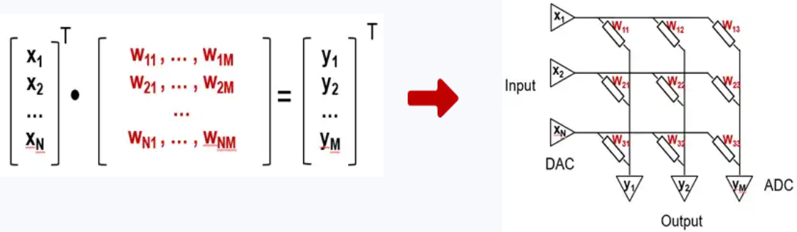
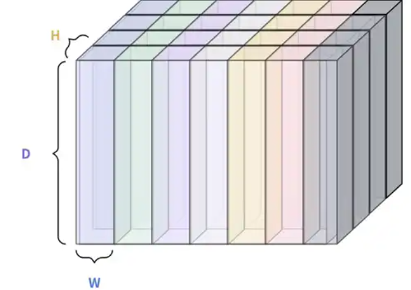

# 赛道二：编译工具链

## 赛道概览

| 项目 | 内容 |
|------|------|
| **一句话看懂** | 实现从 **ONNX 模型** 到 **存算一体硬件指令** 的完整编译流程 |
| **官方链接** | https://www.modelscope.cn/events/189/赛道二：编译工具链 |
| **赛题数量** | **2 个赛题**（任选其一参加） |

---

## 双赛题一览

本赛道提供**两个不同方向的赛题**，参赛队伍可根据团队背景和技术储备选择其中一个参加：

| 赛题 | 核心任务 | 技术重点 | 适合团队背景 |
|------|---------|---------|-------------|
| **赛题一** | 编译器 IR 设计 + ONNX → 硬件指令 | 编译原理、IR 设计、指令生成 | 软件工程、体系结构 |
| **赛题二** | 3D 空间权重排布 + 调度优化 | 数学建模、启发式算法、模拟仿真 | 算法、分布式计算 |

### 赛题一：编译架构设计

**核心目标：** 设计面向存算阵列的编译器中间表示与编译框架

<div align="center">
  
  <p>图 1 知存模拟存算计算方案原理图</p>
</div>

> 📋 **详细赛题内容：** 请阅读 [赛题1.md](./赛题1/赛题1.md)

### 赛题二：权重排布优化

**核心目标：** 设计智能编译器/调度器，将深度学习模型映射到 3D 分层异构资源空间

<div align="center">
  
  <p>图 5 3D 资源空间</p>
</div>

> 📋 **详细赛题内容：** 请阅读 [赛题2.md](./赛题2/赛题2.md)

---

## 共同技术背景

### 存算一体架构简介

**存算一体 (Computing-in-Memory, CIM)** 技术通过将计算融入存储介质（如 NAND Flash），实现了"**位置即算力**"的革新。这种架构有效解决了传统冯·诺依曼架构中的"**存储墙**"问题，特别适用于对能效和实时性要求极高的边缘 AI 部署场景。

**核心优势：**

| 优势 | 说明 |
|------|------|
| **高能效比** | 计算与存储一体化，减少数据搬运能耗 |
| **高计算密度** | 在有限面积内实现更大算力 |
| **低延迟** | 数据无需频繁在存储和计算单元间传输 |

---

## 赛题一专用技术资料

### 目标硬件规格

#### 1. 指令集（3 条基础指令）

**基础指令 1：cim.bit.type**

```
cim.bit.type dst, src, index, weight_pos
```

| 参数 | 说明 |
|------|------|
| dst | 输出数据在 SRAM 中的起始地址 |
| src | 输入数据在 SRAM 中的起始地址 |
| index | 计算输入数据中的第几个 bit |
| weight_pos | 权重数据在存算单元中的坐标位置 [row0, col0, row1, col1] |

**基础指令 2：elt.op.type.mode**

```
elt.op.type.mode dst, src1, src2, len
```

| 参数 | 说明 |
|------|------|
| dst | 输出数据在 SRAM 中的起始地址 |
| src1 | 输入数据 1 在 SRAM 中的起始地址 |
| src2 | 输入数据 2 在 SRAM 中的起始地址 |
| len | 参与计算的元素个数 |

**基础指令 3：mem.copy.dstType.srcType**

```
mem.copy.dstType.srcType dst, src, len
```

| 参数 | 说明 |
|------|------|
| dst | 目的数据在 SRAM 中的起始地址 |
| src | 源数据在 SRAM 中的起始地址 |
| len | 参与计算的元素个数 |

#### 2. 硬件参数

| 参数 | 规格 |
|------|------|
| **2D 存算单元** | row: 1024bit, col: 4096bit |
| **SRAM 容量** | 512KB |
| **数据类型** | int8 / int16 / int32（全程整型） |

#### 3. 编译流程架构

```
┌─────────────────────────────────────────────────────────┐
│                    ONNX 模型输入                         │
└─────────────────────────────────────────────────────────┘
                           │
                           ▼
┌─────────────────────────────────────────────────────────┐
│  第一阶段：前端解析（Frontend Parsing）                  │
│  • 加载 ONNX 文件                                        │
│  • 解析计算图结构                                        │
│  • 提取节点、边、张量信息                                │
│  • 生成初始中间表示（IR）                                │
└─────────────────────────────────────────────────────────┘
                           │
                           ▼
┌─────────────────────────────────────────────────────────┐
│  第二阶段：图优化（Graph Optimization）                  │
│  • 常量折叠（Constant Folding）                          │
│  • 算子融合（Operator Fusion）                           │
│  • 死代码消除（Dead Code Elimination）                   │
│  • 内存布局优化                                          │
└─────────────────────────────────────────────────────────┘
                           │
                           ▼
┌─────────────────────────────────────────────────────────┐
│  第三阶段：量化（Quantization）                          │
│  • FP32 → INT8/INT16 量化                               │
│  • 量化参数计算（scale, zero_point）                     │
│  • 量化误差分析与补偿                                    │
└─────────────────────────────────────────────────────────┘
                           │
                           ▼
┌─────────────────────────────────────────────────────────┐
│  第四阶段：硬件映射（Hardware Mapping）                  │
│  • 算子分解为存算指令                                    │
│  • 存算单元分配                                          │
│  • SRAM 资源分配                                         │
│  • 指令调度与流水线优化                                  │
└─────────────────────────────────────────────────────────┘
                           │
                           ▼
┌─────────────────────────────────────────────────────────┐
│  第五阶段：代码生成（Code Generation）                   │
│  • 生成硬件指令二进制/汇编                               │
│  • 生成运算 - 硬件单元映射表                             │
│  • 生成 SRAM 分配记录                                    │
│  • 输出最终文件                                          │
└─────────────────────────────────────────────────────────┘
```

---

## 赛题二专用技术资料

### 硬件模型：3D 资源空间

#### 三级层级结构

| 层级 | 说明 |
|------|------|
| **全局空间 (Global Space)** | N×N 个相互独立的 Sub-Cubes，提供宏观并行度 |
| **存算核 (Sub-Cube)** | 内部可放置多个 Weight-Cube，同一时刻仅激活 1 个 |
| **权重立方体 (Weight-Cube)** | 神经网络权重在 3D 空间中的映射单元 |

#### Cube 配置约束

| 配置项 | 约束条件 |
|-------|---------|
| Z 轴深度 D | 参赛者根据模型需求自行配置 |
| Sub-Cube 尺寸 H×W | 最小 4096×4096，最大 16384×16384 |
| Cube 总容量 | 最大为模型需要大小的 2 倍 |
| Sub-Cube 数量 N×N | N 最小是 2，最大是 4 |

#### 核心约束

| 约束类型 | 说明 |
|---------|------|
| **Weight Stationary** | Weight-Cube 一旦映射，不可动态迁移 |
| **One Weight-Cube Per Sub-Cube** | 单个 Sub-Cube 同一时刻仅激活 1 个 Weight-Cube |
| **Strict Dependency** | 下游 Layer 必须等待上游所有 Section 输出就绪 |
| **Switching Penalty** | Sub-Cube 内切换 Weight-Cube 产生 D 周期延迟 |

#### 优化目标（按优先级）

| 优先级 | 指标 | 说明 |
|:------:|------|------|
| 1 | 端到端推理延时 | 完成整个模型推理所需的总周期数 |
| 2 | 空间利用率 | 成功映射的模型参数总量与占用 3D 空间体积的比值 |
| 3 | 大模型适配性 | 能够成功映射 DeepSeek-671B 模型 |

---

## 通用开发指南

### 推荐技术路线

#### 方案一：基于现有编译器框架扩展

| 框架 | 适用赛题 | 优势 |
|------|---------|------|
| **MLIR** | 赛题一 | 多级 IR 设计，模块化好 |
| **TVM** | 赛题一 | 深度学习编译生态成熟 |
| **自定义框架** | 赛题二 | 灵活定制调度算法 |

#### 方案二：自研轻量级编译器

| 组件 | 技术栈 |
|------|--------|
| 前端解析 | Python + ONNX Runtime |
| IR 设计 | 自定义 JSON 格式 |
| 优化器 | Python / C++ |
| 代码生成 | Python 脚本 |

### 开发环境依赖

```bash
# Python 环境
Python >= 3.8

# 核心库
onnx >= 1.10.0
onnxruntime >= 1.9.0
numpy >= 1.20.0

# 可选：深度学习框架
pytorch >= 1.9.0
tensorflow >= 2.6.0
```

### 常用工具

| 工具 | 用途 |
|------|------|
| **Netron** | ONNX 模型可视化 |
| **VS Code / PyCharm** | 代码编辑与调试 |
| **Git** | 版本控制 |

---

## 常见问题解答

### Q1: ONNX 模型解析失败怎么办？

**可能原因：**
- ONNX 版本不兼容
- 模型包含不支持的算子
- 模型格式损坏

**解决方案：**
1. 使用 `onnx.checker.check_model()` 验证模型合法性
2. 使用 Netron 可视化检查模型结构
3. 更新 onnx 库到最新版本

### Q2: SRAM 容量不足如何处理？

**优化策略：**

| 策略 | 适用赛题 | 说明 |
|------|---------|------|
| 算子融合 | 赛题一 | 减少中间结果存储 |
| 分层编译 | 赛题一/二 | 大模型分层加载执行 |
| 权重压缩 | 赛题一 | 采用稀疏化、量化技术 |
| 内存复用 | 赛题一 | 动态分配，及时释放 |

### Q3: 如何验证生成的方案正确性？

**赛题一：**
- 实现软件模拟器，执行生成的指令
- 与 ONNX Runtime 的推理结果对比
- 计算输出差异（MSE、余弦相似度等）

**赛题二：**
- 检查空间互斥等物理约束是否满足
- 运行模拟器计算端到端延时
- 对比不同映射策略的性能差异

---

## 提交要求汇总

### 设计报告 (doc/docx 及 pdf 文件)

| 章节 | 内容要求 |
|------|---------|
| a) 引言 | 研究背景与意义 |
| b) 工作原理与关键技术原理分析 | 包括基本概念、处理流程以及数学建模等；结构设计：包括结构选择、模块划分、技术选型、接口描述等 |
| c) 详细设计与实现 | 包括软件流程图、关键代码分析等、优化排布论证与分析 |
| d) 程序运行效果与实验结果 | 实验数据与结果分析 |
| e) 总结 | 工作总结与展望 |
| f) 参考文献和团队介绍 | 学术规范与团队信息 |

### 介绍 PPT

主要工作、创新点、结果、结论。

### 演示视频 (MP4 格式)

- **时长：** 控制在 **5 分钟以内**
- **内容：** 主要展示实现的全流程、优化排布思路及优化前后效果对比
- **要求：** 视频讲解清晰完整，演示过程流畅，数据展示有说服力

### 设计代码

工程代码应该与设计报告中的详细设计相匹配。

---

## 赛题一评分标准

| 评分模块 | 评分项 | 分值 |
|---------|-------|:----:|
| 部署框架 | IR设计（表达能力、简洁性、扩展性） | 20 |
| | 模型解析（完成 onnx 模型到 IR 转换） | 10 |
| 指令生成 | 生成正确的指令序列 | 15 |
| | 资源管理策略 | 15 |
| 整体实施方案 | Transform/Lowering | 20 |
| 技术路线 | 在实现过程中，如果在技术路线上有成功的改进或突破，可以根据技术路线的先进性判别得分 | 10 |
| 设计报告 | 应详细阐述技术方案，突出关键技术要点，报告应结构清晰、逻辑流畅、详略得当 | 5 |
| 现场答辩 | 讲解思路清晰，语言流畅 | 5 |
| **总分** | | **100** |

---

## 赛题二评分标准

| 评分模块 | 评分项 | 分值 |
|---------|-------|:----:|
| **任务实现** | | |
| | 模型解析：完成模型描述（JSON/ONNX）到权重（Sections）的转换 | - |
| | 编译映射：完成权重到存算阵列（3D Space）的映射排序 | - |
| | 配置验证：完成排序结果检测与存算阵列的计算模拟 | - |
| **部署框架** | | 60 |
| **优化排序效果** | | |
| | 存算阵列的利用率（Space Utilization） | - |
| | 存算阵列的执行效率（End-to-End Latency） | - |
| | 排布算法的求解效率（Solver Runtime） | 15 |
| **技术路线** | 在实现过程中，如果在技术路线（如 3D 调度算法、MoE 优化策略）上有成功的改进或突破，可以根据技术路线的先进性判别得分 | 10 |
| **设计报告** | 应详细阐述技术方案，突出关键技术要点，报告应结构清晰、逻辑流畅、详略得当 | 15 |
| **总分** | | **100** |

---

## 备赛时间规划建议

| 阶段 | 时间 | 任务 |
|------|------|------|
| **阶段一** | 第 1-2 周 | 学习 ONNX 格式、理解硬件指令集规范 / 理解 3D 资源空间模型 |
| **阶段二** | 第 3-4 周 | 实现前端解析器，完成 IR 设计 / 设计权重排布算法 |
| **阶段三** | 第 5-6 周 | 实现图优化与量化模块 / 实现冲突检测与调度优化 |
| **阶段四** | 第 7-8 周 | 实现硬件映射与指令生成 / 实现模拟器验证 |
| **阶段五** | 第 9-10 周 | 系统联调、性能优化、文档撰写 |

---

## 学习资源

### ONNX 相关

| 资源 | 链接 |
|------|------|
| ONNX 官网 | https://onnx.ai/ |
| ONNX 规范 | https://github.com/onnx/onnx/blob/main/docs/IR.md |
| ONNX 模型库 | https://github.com/onnx/models |

### 编译器技术

| 资源 | 适用赛题 |
|------|---------|
| TVM 教程 | 赛题一 |
| MLIR 文档 | 赛题一 |
| 深度学习编译技术综述 | 赛题一 |

### 存算一体

| 资源 | 说明 |
|------|------|
| IEEE ISSCC/IEDM 会议论文 | 前沿研究 |
| 知存科技技术白皮书 | 产业背景 |

---

## 关键资源链接

| 资源 | 链接 |
|------|------|
| **赛事主页** | https://www.modelscope.cn/events/189/赛事介绍 |
| **赛道页面** | https://www.modelscope.cn/events/189/赛道二：编译工具链 |
| **赛题包下载** | https://resources.modelscope.cn/third-part/files/存算一体编译架构设计赛题包.zip |

---

## 文件目录

```
赛道2/
├── 赛道二_编译工具链.md    # 本文件 - 赛道总览与指南
├── 赛题1/
│   ├── 赛题1.md            # 赛题一详细内容：编译架构设计
│   ├── 图1.png             # 知存模拟存算计算方案原理图
│   ├── 图2.png             # No-bias linear ONNX
│   └── 图3.png             # 资源分配示意图
├── 赛题2/
│   ├── 赛题2.md            # 赛题二详细内容：权重排布优化
│   ├── 图4.png             # 权重排布
│   ├── 图5.png             # 3D 资源空间
│   └── 图6.png             # 评判标准
```

---

*文档更新时间：2026-05-08*  
*信息来源：官方赛题说明*
