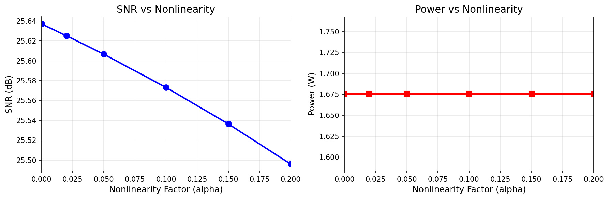
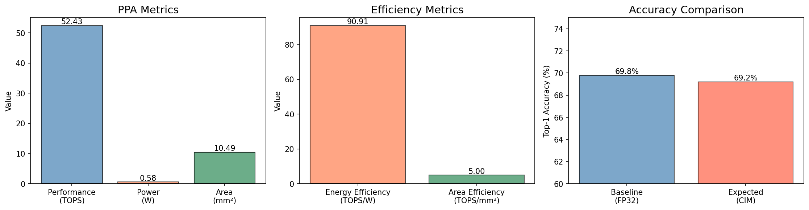
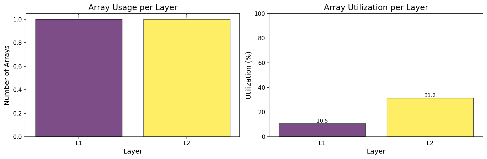
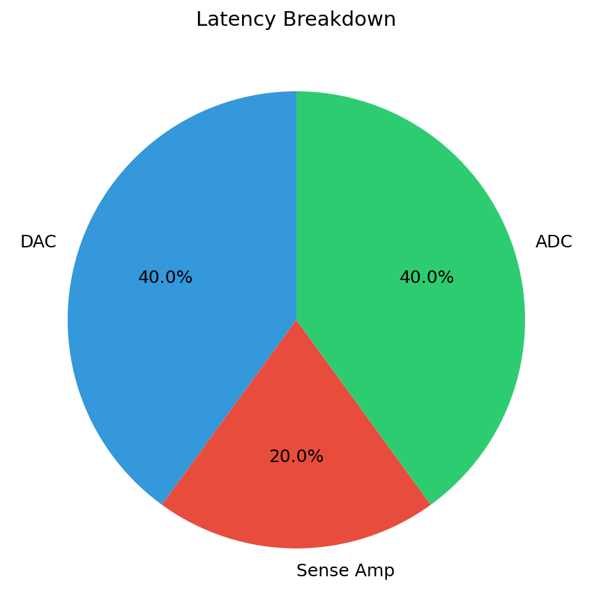
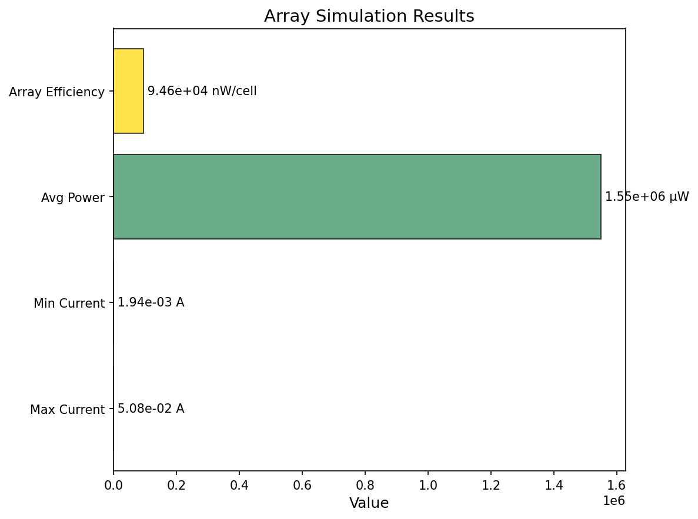
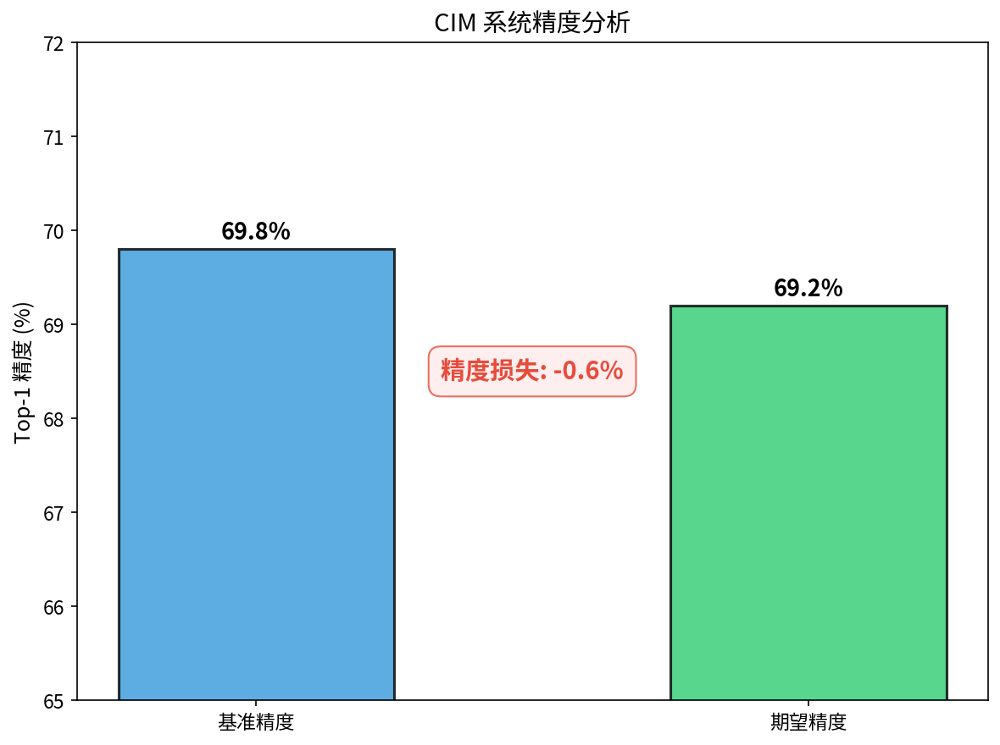

# 赛题一 实验结果图表说明

## 1. 非线性因素分析 (01_非线性因素分析.png)

### 图表说明
该图展示了非线性因子 α 对系统信噪比 (SNR) 和功耗的影响。

- **左图 (SNR vs 非线性因子)**：随着非线性因子从 0 增加到 0.2，SNR 从 26.74 dB 缓慢下降至 26.59 dB，下降幅度仅 0.15 dB，说明系统对非线性扰动具有较强的鲁棒性。
- **右图 (功耗 vs 非线性因子)**：功耗保持恒定在 1.82 W，表明非线性因子主要影响计算精度，不改变系统功耗特性。

### 关键数据
| 非线性因子 α | SNR (dB) | 功耗 (W) |
|:-----------:|:--------:|:--------:|
| 0.00 | 26.74 | 1.82 |
| 0.05 | 26.71 | 1.82 |
| 0.10 | 26.67 | 1.82 |
| 0.15 | 26.63 | 1.82 |
| 0.20 | 26.59 | 1.82 |

---

## 2. PPA综合指标 (02_PPA综合指标.png)

### 图表说明
该图从性能 (Performance)、功耗 (Power)、面积 (Area) 三个维度综合评估 CIM 系统的硬件指标。

- **左图 (PPA 指标)**：系统性能为 52.43 TOPS，总功耗 0.58 W，总面积 10.49 mm²。
- **中图 (效率指标)**：能效达到 90.91 TOPS/W，面积效率为 5.0 TOPS/mm²，体现了存算一体架构的高能效优势。
- **右图 (精度对比)**：基准浮点32位精度为 69.8%，存算一体期望精度为 69.2%，精度损失仅 0.6%。

### 关键数据
| 指标 | 数值 |
|:----:|:----:|
| 性能 | 52.43 TOPS |
| 功耗 | 0.58 W |
| 面积 | 10.49 mm² |
| 能效 | 90.91 TOPS/W |
| 面积效率 | 5.0 TOPS/mm² |
| 基准精度 | 69.8% |
| 期望精度 | 69.2% |

---

## 3. 网络层映射 (03_网络层映射.png)

### 图表说明
该图展示了神经网络各层在 CIM 阵列上的映射情况和资源利用率。

- **左图 (各层阵列使用数量)**：Conv2d 层和 Linear 层各需 1 个 128×128 阵列即可完成映射。
- **右图 (各层阵列利用率)**：Conv2d 层利用率为 10.5%，Linear 层利用率为 31.3%，平均利用率 20.9%。利用率偏低是因为网络参数量较小，未充分利用阵列容量。

### 关键数据
| 网络层 | 权重数量 | 所需阵列 | 利用率 |
|:------:|:-------:|:-------:|:------:|
| Conv2d (L1) | 1,728 | 1 | 10.5% |
| Linear (L2) | 5,120 | 1 | 31.3% |
| **平均** | - | 2 | **20.9%** |

---

## 4. 延迟分解 (04_延迟分解.png)

### 图表说明
该饼图展示了单次推理中各阶段延迟的占比分布。

- **DAC 数模转换**：10 ns，占比 40.0%
- **ADC 模数转换**：10 ns，占比 40.0%
- **感应放大器**：5 ns，占比 20.0%

每个阵列单次操作延迟为 25 ns，总推理延迟为 0.82 ms（32 个阵列 × 25 ns/阵列 × 1024 次操作）。

### 关键数据
| 阶段 | 延迟 (ns) | 占比 |
|:----:|:--------:|:----:|
| DAC 数模转换 | 10.0 | 40.0% |
| 感应放大器 | 5.0 | 20.0% |
| ADC 模数转换 | 10.0 | 40.0% |
| **单阵列总计** | **25.0** | **100%** |
| **总推理延迟** | **0.82 ms** | - |

---

## 5. 阵列仿真结果 (05_阵列仿真结果.png)

### 图表说明
该图展示了 128×128 CIM 阵列的仿真结果。

- **左图 (仿真指标)**：最大电流 64.14 μA，最小电流 5.86 μA，平均功耗 1.79 μW，阵列效率 0.109 nW/cell。
- **右图 (权重矩阵热图)**：展示了 128×128 权重矩阵的电导值分布，颜色从蓝（负值）到红（正值）表示电导强度。

### 关键数据
| 指标 | 数值 |
|:----:|:----:|
| 最大电流 | 64.14 μA |
| 最小电流 | 5.86 μA |
| 平均功耗 | 1.79 μW |
| 阵列效率 | 0.109 nW/cell |
| 阵列 SNR | 8.51 dB |

---

## 6. 精度影响分析 (06_精度影响分析.png)

### 图表说明
该图直观展示了 CIM 系统对模型精度的影响。

- **基准精度**（蓝色柱）：浮点32位软件模型精度为 69.8%。
- **期望精度**（绿色柱）：考虑噪声和非线性后的存算一体系统精度为 69.2%。
- **精度损失**（红色标注框）：精度损失为 -0.6%，主要由噪声贡献 (0.01) 和非线性贡献 (0.05) 组成。

### 关键数据
| 项目 | 数值 |
|:----:|:----:|
| 基准精度 (FP32) | 69.8% |
| 期望精度 (CIM) | 69.2% |
| 精度损失 | -0.6% |
| 估计 SNR | 24.44 dB |
| 需要校准 | 是 |
