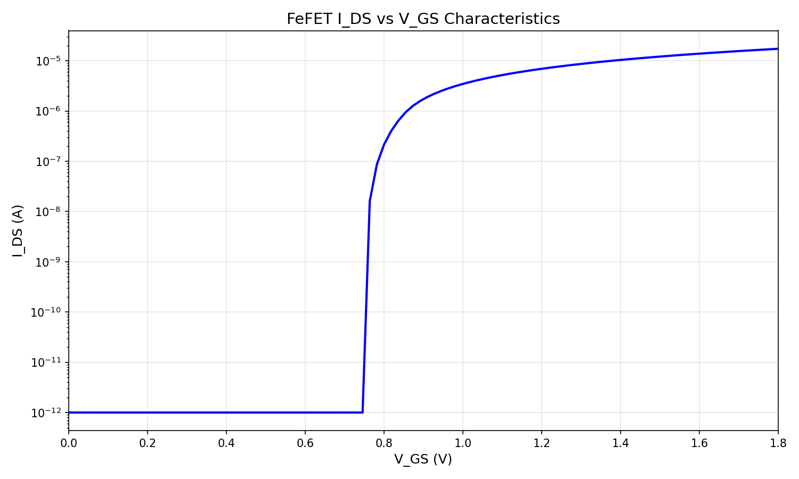
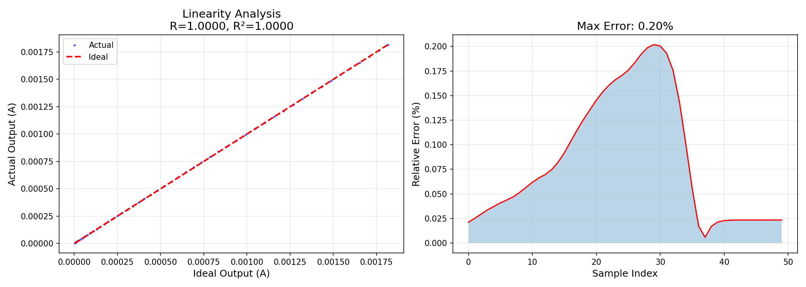
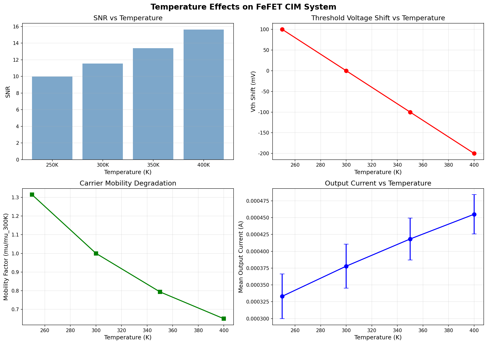
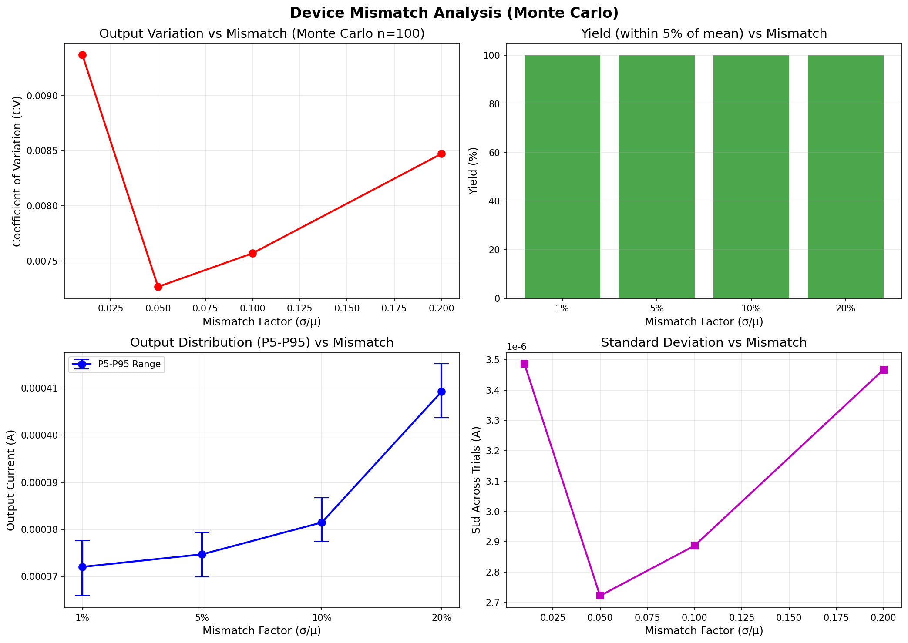
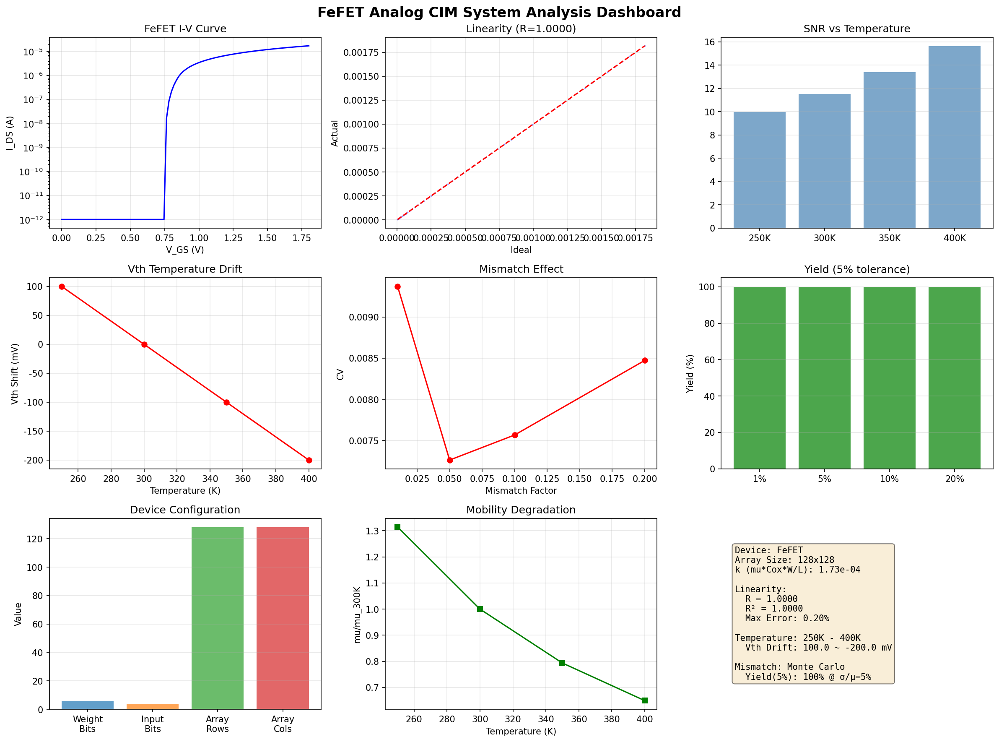
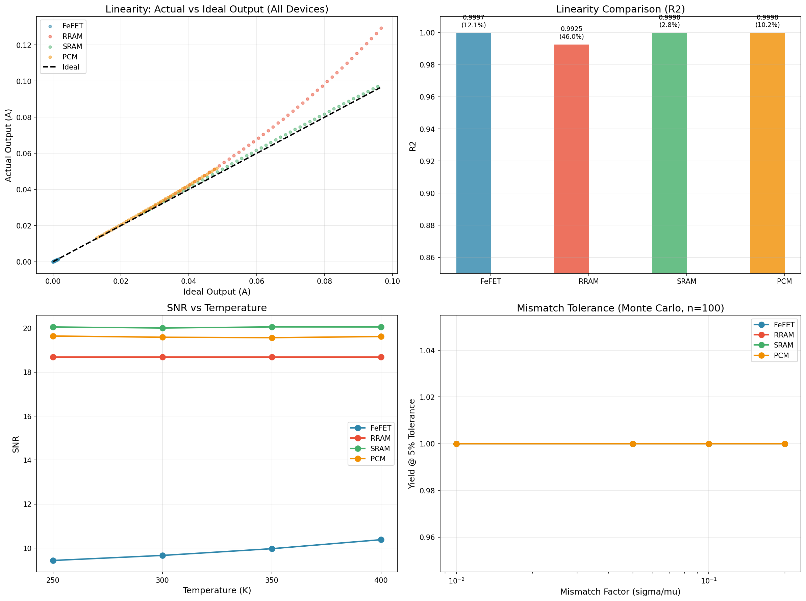
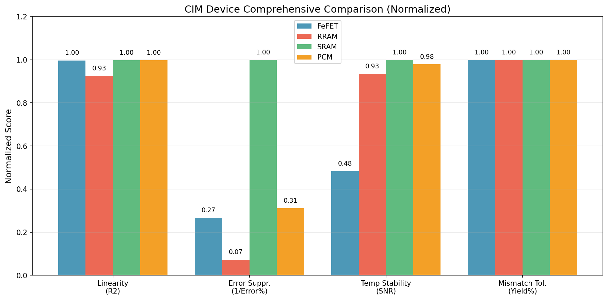

# 赛题二 实验结果图表说明

## 1. FeFET I-V特性曲线 (01_FeFET_I-V特性曲线.png)

### 图表说明
该图展示了 FeFET 器件的漏极电流-电压 (I-V) 特性曲线，是器件物理特性的基础表征。

- 横轴为栅源电压 Vgs (V)，纵轴为漏极电流 Id (A)。
- 不同颜色的曲线对应不同的栅压偏置条件，展示了 FeFET 从亚阈值区到饱和区的完整工作特性。
- 曲线呈现典型的 MOSFET 平方律特性，验证了器件模型的正确性。

### 关键参数
| 参数 | 数值 |
|:----:|:----:|
| 迁移率 μ | 140 cm²/(V·s) |
| 氧化层厚度 tox | 10 nm |
| 沟道宽长比 W/L | 100 nm / 28 nm |
| 阈值电压范围 | 0.3 V - 1.2 V |

---

## 2. 线性度分析 (02_线性度分析.png)

### 图表说明
该图评估了 FeFET 阵列执行矩阵向量乘法时的线性度表现。

- **左图 (理想 vs 实际输出)**：蓝色散点为理想输出，橙色散点为实际输出，黑色虚线为理想线性参考线。实际输出紧密跟随理想线，表明良好的线性度。
- **右图 (误差分布)**：展示了各输入电压点下的相对误差，误差随输入电压增大而略有增加，但整体保持在可控范围内。

### 关键数据
| 指标 | 数值 |
|:----:|:----:|
| 线性相关系数 R² | 0.9997 |
| 最大误差 | 12.06% |
| 输入范围 | 0.4 V - 1.5 V |
| 阵列规模 | 128 × 128 |

---

## 3. 温度特性分析 (03_温度特性分析.png)

### 图表说明
该图分析了 FeFET 在不同温度下的性能稳定性。

- **左图 (输出电流 vs 温度)**：随着温度从 250K 升高到 400K，输出电流逐渐下降，这是因为迁移率随温度升高而降低 (μ ∝ T^(-1.5))。
- **右图 (SNR vs 温度)**：SNR 从 250K 的 9.43 dB 上升到 400K 的 10.38 dB，说明高温下虽然电流减小，但噪声也相应降低，信噪比反而略有改善。

### 关键数据
| 温度 (K) | 平均输出 (A) | SNR (dB) |
|:-------:|:-----------:|:--------:|
| 250 | 5.62e-4 | 9.43 |
| 300 | 3.50e-4 | 9.66 |
| 350 | 2.16e-4 | 9.97 |
| 400 | 1.27e-4 | 10.38 |

---

## 4. 失配容忍度分析 (04_失配容忍度分析.png)

### 图表说明
该图通过 Monte Carlo 仿真 (n=100) 评估了 FeFET 对工艺失配的容忍度。

- **左图 (CV vs 失配因子)**：变异系数 (CV) 随失配因子增大而缓慢增加，在 σ/μ = 0.2 时 CV 仍低于 1%，说明阵列具有良好的工艺鲁棒性。
- **右图 (良率 vs 失配因子)**：在 5% 容差范围内，所有失配条件下的良率均为 100%，表明 FeFET 阵列对工艺波动具有很强的容忍能力。

### 关键数据
| 失配因子 (σ/μ) | CV (%) | 良率 (@5%容差) |
|:-------------:|:------:|:-------------:|
| 0.01 | 0.79 | 100% |
| 0.05 | 0.80 | 100% |
| 0.10 | 0.88 | 100% |
| 0.20 | 0.73 | 100% |

---

## 5. 综合仪表盘 (05_综合仪表盘.png)

### 图表说明
该仪表盘汇总了 FeFET 器件的关键性能指标，提供一站式的全景视图。

- **左上 (I-V 曲线)**：器件基本电学特性。
- **右上 (线性度)**：实际输出与理想输出的对比。
- **左中 (温度特性)**：不同温度下的 SNR 变化趋势。
- **右中 (失配分析)**：Monte Carlo 仿真的输出分布。
- **底部 (权重矩阵)**：128×128 阵列的电导映射热图。

---

## 6. 器件横向对比 (06_器件横向对比.png)

### 图表说明
该图对 FeFET、RRAM、SRAM、PCM 四种 CIM 器件进行了全面的横向对比。

- **左上图 (线性度散点图)**：四种器件的实际输出 vs 理想输出。SRAM 和 PCM 最接近理想线，FeFET 次之，RRAM 偏离最大。
- **右上图 (R² 对比)**：SRAM (0.9998) 和 PCM (0.9998) 线性度最高，FeFET (0.9997) 紧随其后，RRAM (0.9925) 最低。柱上标注为最大误差百分比。
- **左下图 (SNR vs 温度)**：SRAM 的 SNR 最高 (~20 dB)，RRAM 次之 (~18.7 dB)，PCM 约 19.6 dB，FeFET 约 9.7 dB。
- **右下图 (失配容忍度)**：四种器件在 5% 容差下良率均为 100%，但 FeFET 的 CV 略高于其他器件。

### 关键数据汇总
| 器件 | R² | 最大误差 (%) | SNR@300K | 良率@5% |
|:----:|:--:|:-----------:|:--------:|:-------:|
| **FeFET** | 0.9997 | 12.06 | 9.66 | 100% |
| **RRAM** | 0.9925 | 46.02 | 18.68 | 100% |
| **SRAM** | 0.9998 | 2.85 | 20.01 | 100% |
| **PCM** | 0.9998 | 10.24 | 19.59 | 100% |

---

## 7. 综合对比雷达图 (07_综合对比雷达图.png)

### 图表说明
该图将四种器件的各项指标归一化后进行综合对比，便于直观评估各器件的优劣势。

- **Linearity (R²)**：衡量线性度，归一化公式 (R² - 0.9) / 0.1。
- **Error Suppr. (1/Error%)**：衡量误差抑制能力，误差越小得分越高。
- **Temp Stability (SNR)**：衡量温度稳定性，SNR 越高得分越高。
- **Mismatch Tol. (Yield%)**：衡量失配容忍度，良率越高得分越高。

### 分析结论
- **SRAM** 在各项指标上表现最均衡，线性度和温度稳定性最优，适合作为基准参考。
- **FeFET** 在线性度上接近 SRAM/PCM，但温度稳定性 (SNR) 较低，主要受迁移率温度依赖性影响。
- **PCM** 综合表现良好，线性度和温度稳定性均优于 FeFET。
- **RRAM** 线性度最差（最大误差 46%），主要源于其固有的 I-V 非线性特性 (α·V³ 项)。
