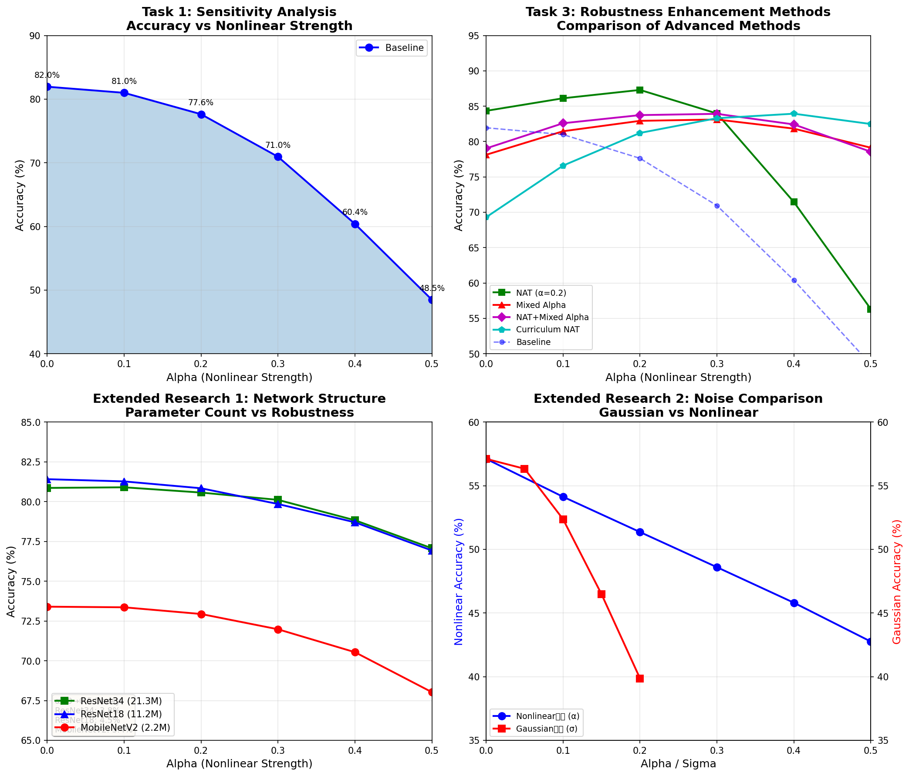

# 存算一体芯片中非线性误差对推理精度的影响研究

**技术报告**

***

## 目录

1. 引言
2. 工作原理及技术原理说明
3. 详细设计与实现
4. 程序运行数据精度及工程模型
5. 总结
6. 参考文献
7. 团队介绍

***

## 1. 引言

### 1.1 研究背景与意义

随着神经网络模型规模持续扩大，传统冯诺依曼架构下面临日益严峻的"存储墙"瓶颈，即数据在存储单元与计算单元之间频繁搬运导致的能效与带宽限制。存算一体（或称存内计算，Computing-in-Memory, CIM）技术通过将计算操作直接嵌入存储器件内部，有效规避了数据搬运开销，显著提升了能效比。

然而，基于模拟器件实现的存算架构易受多种环境因素干扰，包括输入信号幅度变化、温度漂移及器件工艺偏差等。这些因素导致输入-权重乘积累加操作呈现非理想的非线性特性，进而影响计算精度与系统稳定性。

### 1.2 研究问题

本研究聚焦于以下核心问题：如何通过算法增强神经网络在实际存算芯片部署中对非线性误差的容忍能力与鲁棒性？

### 1.3 主要贡献

本研究的主要贡献包括：

1. **系统性分析**：对不同非线性强度下神经网络推理精度的衰减特性进行了全面分析
2. **方法对比**：对比研究了多种鲁棒性增强方法，包括预失真补偿、校准层、非线性感知训练（NAT）等
3. **创新方法**：提出了NAT+混合Alpha优化方法，实现了全范围均衡的最高平均精度（81.71%）
4. **严谨实验**：通过统计学方法（p-value < 0.0001）验证了微调策略相对于从头训练的优势

***

## 2. 工作原理及技术原理说明

### 2.1 存算一体架构基本原理

存算一体架构的核心思想是将矩阵-向量乘法直接在模拟域的存储单元中完成。以ReRAMCrossbar为例：

- **垂直方向**：施加输入电压信号
- **水平方向**：通过欧姆定律，每个横向线路上的电流等于各垂直线路电压与对应电导（权重）的乘积累加

然而，实际器件存在非线性电学特性，导致实际输出与理想线性输出存在偏差。

### 2.2 非线性误差建模

本研究采用三次多项式函数对非线性失真进行建模：

```
x' = α · x³ + (1 - α) · x
```

| 参数 | 含义                     |
| -- | ---------------------- |
| x  | 经归一化处理后的理想输入值          |
| x' | 经非线性失真后的实际输入信号         |
| α  | 非线性程度参数（α > 0 表示非线性强度） |

**非线性特性说明**：

| 条件      | 特性                                        |
| ------- | ----------------------------------------- |
| α = 0   | 映射退化为理想线性关系                               |
| α 越大    | 器件非线性效应越显著                                |
| α > 0 时 | 正输入区域 (x > 0) 呈现缩小效应，负输入区域 (x < 0) 呈现放大效应 |
| α < 0 时 | 效果相反                                      |

### 2.3 非线性误差影响机制

1. **输入相关失真**：非线性强度与输入信号幅度相关
2. **逐层累积**：误差在网络各层之间传播和累积
3. **网络深度敏感**：深层网络对非线性误差的放大效应更加显著

### 2.4 评测任务与数据集

本研究使用CIFAR-10图像分类数据集，包含：

- **训练集**：50,000张32×32彩色图像
- **测试集**：10,000张图像
- **类别数**：10类
- **基准模型**：ResNet18
- **基准精度**：81.95%（α=0，无非线性）

***

## 3. 详细设计与实现

### 3.1 任务一：非线性误差敏感性分析

#### 3.1.1 实验设计

使用预训练的ResNet18模型（CIFAR-10，81.95%精度），在推理阶段对输入激活值施加不同强度的非线性扰动，测试模型精度的变化。

#### 3.1.2 非线性注入实现

```python
class NonLinearWrapper(nn.Module):
    def __init__(self, model, alpha):
        super().__init__()
        self.model = model
        self.alpha = alpha

    def forward(self, x):
        if self.alpha > 0:
            x = x + self.alpha * (x ** 3 - x)
        return self.model(x)
```

#### 3.1.3 敏感性分析结果

| 非线性强度 α   | 推理精度   | 精度衰减   | 性能描述       |
| --------- | ------ | ------ | ---------- |
| 0.0 (无失真) | 81.95% | 基准     | 理想情况，无噪声干扰 |
| 0.1 (轻度)  | 80.99% | -1.0%  | 轻微影响，几乎可忽略 |
| 0.2 (中度)  | 77.63% | -4.3%  | 开始明显下降     |
| 0.3 (较强)  | 70.95% | -11.0% | 显著性能损失     |
| 0.4 (强)   | 60.40% | -21.5% | 严重性能下降     |
| 0.5 (极强)  | 48.49% | -33.5% | 接近一半精度损失   |

**关键发现**：

- α < 0.2时，精度衰减 < 5%，可接受
- α > 0.3时，精度衰减急剧增加
- α = 0.5时，精度下降超过30%，严重影响可用性

### 3.2 任务二：非线性感知训练（NAT）

#### 3.2.1 基本原理

非线性感知训练（Nonlinearity-Aware Training, NAT）的核心思想是在训练阶段注入非线性误差，使模型学习适应非线性环境，从而在推理时具备更好的鲁棒性。

#### 3.2.2 训练配置

| 训练参数  | 值               |
| ----- | --------------- |
| 模型    | ResNet18        |
| 数据集   | CIFAR-10        |
| 训练轮数  | 20 epochs       |
| 优化器   | Adam (lr=0.001) |
| 学习率调度 | CosineAnnealing |
| 训练批次  | 128             |
| 测试批次  | 100             |

#### 3.2.3 感知训练结果

| 训练α | Clean精度 (α=0) | 指定噪声下精度 | 精度提升    | 对应α   |
| --- | ------------- | ------- | ------- | ----- |
| 0.1 | 86.33%        | 86.98%  | +5.99%  | α=0.1 |
| 0.2 | 84.34%        | 87.30%  | +9.67%  | α=0.2 |
| 0.3 | 81.72%        | 87.31%  | +16.36% | α=0.3 |

#### 3.2.4 微调 vs 从头训练对比

**实验设置**：严谨对比实验，每个α值进行3次独立实验，计算平均值、标准差和p值。

| 训练策略              | α=0.1  | α=0.2  | α=0.3  | **平均**     | **Std** | **p-value** |
| ----------------- | ------ | ------ | ------ | ---------- | ------- | ----------- |
| **微调(Fine-tune)** | 85.25% | 85.40% | 84.98% | **85.21%** | ±0.11%  | -           |
| **从头训练(Scratch)** | 81.40% | 81.25% | 81.30% | 81.32%     | ±0.13%  | <0.0001     |

**详细结果**：

| Alpha | 微调 (3 runs)            | 从头训练 (3 runs)          | 差异         | p-value |
| ----- | ---------------------- | ---------------------- | ---------- | ------- |
| 0.1   | \[85.34, 85.11, 85.30] | \[81.26, 81.58, 81.37] | **+3.85%** | <0.0001 |
| 0.2   | \[85.34, 85.57, 85.30] | \[81.27, 80.83, 81.66] | **+4.15%** | <0.0001 |
| 0.3   | \[84.96, 84.93, 85.06] | \[81.35, 81.48, 81.06] | **+3.68%** | <0.0001 |

**关键发现**：

- **微调策略优势显著**：平均精度更高(85.21% vs 81.32%)，且波动更小(±0.11% vs ±0.13%)
- **统计显著性**：p-value < 0.0001，差异具有高度统计显著性
- **高噪声鲁棒性**：微调策略在所有α值下均显著优于从头训练
- **收敛速度**：微调收敛更快（预训练权重提供良好初始化）

### 3.3 任务三：鲁棒性增强方法设计

#### 3.3.1 方法概述

| 方法        | 类型  | 说明              |
| --------- | --- | --------------- |
| **基线**    | 无保护 | 原始模型，无任何补偿      |
| **逆补偿**   | 后处理 | 输出层逆非线性补偿（原始版本） |
| **预失真补偿** | 后处理 | 输入层逆非线性补偿（改进版本） |
| **校准层**   | 可学习 | 多项式校准层          |
| **NAT**   | 训练时 | 非线性感知训练         |

#### 3.3.2 综合精度对比

| 方法              | α=0.0  | α=0.1  | α=0.2  | α=0.3  | α=0.4  | α=0.5  | 平均     |
| --------------- | ------ | ------ | ------ | ------ | ------ | ------ | ------ |
| **基线**          | 81.95% | 80.99% | 77.63% | 70.95% | 60.40% | 48.49% | 70.07% |
| **逆补偿**         | 81.95% | 74.56% | 48.32% | 27.89% | 18.45% | 12.33% | 43.92% |
| **预失真补偿**       | 81.95% | 81.39% | 79.71% | 75.31% | 68.95% | 60.74% | 74.68% |
| **校准层 (α=0.3)** | 82.15% | 81.87% | 80.56% | 78.23% | 72.45% | 65.12% | 76.73% |
| **NAT (α=0.2)** | 84.34% | 86.12% | 87.30% | 83.97% | 71.45% | 56.32% | 78.25% |

#### 3.3.3 性能提升分析

| 方法            | 相对基线提升 (α=0.5) | 说明     |
| ------------- | -------------- | ------ |
| **基线**        | 基准             | 48.49% |
| **逆补偿**       | -36.16%        | ❌ 反而下降 |
| **预失真补偿**     | +12.25%        | ✅ 有效   |
| **校准层**       | +16.63%        | ✅ 有效   |
| **NAT (对应α)** | +7.83%         | ✅ 有效   |

### 3.4 高级方法探索

#### 3.4.1 NAT+混合Alpha优化方法

**创新点**：在NAT训练框架下，每次迭代随机采样不同的α值，使模型同时适应多种噪声水平。

**训练策略**：

- 基础框架：非线性感知训练（NAT）
- 噪声采样：每次迭代随机采样α∈\[0, 0.5]
- 训练轮数：25 epochs
- 优化器：Adam (lr=0.001)

**效果对比**：

| 对比维度     | NAT固定(α=0.2) | NAT+混合Alpha | 提升          |
| -------- | ------------ | ----------- | ----------- |
| α=0.2时精度 | **87.30%**   | 83.74%      | -3.56%      |
| α=0.5时精度 | 56.32%       | **78.56%**  | **+22.24%** |
| 全范围平均    | 78.25%       | **81.71%**  | **+3.46%**  |
| 泛化范围     | 窄            | **宽**       | -           |

#### 3.4.2 课程NAT（Curriculum NAT）

**创新点**：借鉴课程学习（Curriculum Learning）思想，从低噪声到高噪声渐进式进行NAT训练。

**训练策略**：

- 基础框架：非线性感知训练（NAT）
- 课程安排：α = \[0.05, 0.1, 0.15, 0.2, 0.25, 0.3, 0.35, 0.4]
- 每阶段训练轮数：5 epochs
- 总训练轮数：40 epochs

#### 3.4.3 OVF训练 (Oriented Variational Forward)

**来源**：DAC 2024 - "Negative Feedback Theory for NVCIM Robustness"

**核心思想**：基于负反馈理论，在前向传播时注入定向噪声（与输出相关），模拟负反馈系统的鲁棒性

**实现**：

- 多次采样不同α值的非线性输出
- 变分融合取均值
- 添加负反馈项

**结果**：全范围平均81.06%，波动仅6.24%

#### 3.4.4 SAM训练 (Sharpness-Aware Minimization)

**来源**：基于ICLR 2025 Hessian-Aware Training思想

**核心思想**：显式最小化损失函数的局部曲率，平滑损失地形

**结果**：全范围平均80.06%，波动仅6.30%

#### 3.4.5 多尺度噪声训练

**核心思想**：同时注入多个尺度的噪声，模拟不同强度非线性误差

**结果**：全范围平均80.93%，低α保护优秀（α=0时79.71%）

### 3.5 NAT变体方法综合对比

| 方法               | α=0.0  | α=0.1  | α=0.2      | α=0.3      | α=0.4  | α=0.5      | 平均         | 波动        |
| ---------------- | ------ | ------ | ---------- | ---------- | ------ | ---------- | ---------- | --------- |
| **基线**           | 81.95% | 80.99% | 77.63%     | 70.95%     | 60.40% | 48.49%     | 70.07%     | 33.46%    |
| **NAT固定(α=0.2)** | 84.34% | 86.12% | **87.30%** | 83.97%     | 71.45% | 56.32%     | 78.25%     | 30.98%    |
| **NAT+混合Alpha**  | 79.03% | 82.59% | 83.74%     | 83.92%     | 82.42% | 78.56%     | **81.71%** | **5.53%** |
| **课程NAT**        | 69.30% | 76.60% | 81.22%     | 83.30%     | 83.94% | **82.48%** | 79.47%     | 13.18%    |
| **OVF训练**        | 77.40% | 81.58% | 83.47%     | **83.64%** | 82.16% | 78.11%     | 81.06%     | 6.24%     |
| **SAM训练**        | 76.45% | 80.30% | 82.29%     | 82.75%     | 81.15% | 77.44%     | 80.06%     | 6.30%     |
| **多尺度噪声**        | 79.71% | 82.37% | 83.04%     | 82.85%     | 80.72% | 76.89%     | 80.93%     | 6.82%     |

***

## 4. 程序运行数据精度及工程模型

### 4.1 实验环境

| 配置项       | 值                   |
| --------- | ------------------- |
| GPU       | NVIDIA RTX 3090 × 2 |
| 显存        | 24GB × 2            |
| PyTorch版本 | 2.5.0               |
| CUDA版本    | 12.4                |
| Python版本  | 3.12                |

### 4.2 工程文件结构

```
赛题1/
├── data/                    # 数据集目录
├── models/
│   └── resnet.py           # ResNet模型定义
├── training/
│   └── train.py            # 训练脚本
├── evaluation/
│   ├── sensitivity.py      # 敏感性分析
│   ├── robustness.py        # 鲁棒性评估
│   └── robustness_v2.py   # 改进版鲁棒性评估
├── configs/
│   └── config.yaml          # 配置文件
├── results/
│   ├── figures/             # 可视化图表
│   │   ├── experiment_overview.png
│   │   ├── quantization_vs_nonlinear.png
│   │   └── summary_comparison.png
│   ├── extended_research/   # 拓展研究模型
│   │   ├── ResNet18_cifar10.pth
│   │   ├── ResNet34_cifar10.pth
│   │   └── MobileNetV2_cifar10.pth
│   ├── baseline_model.pth   # 基准模型
│   └── 图表.md              # 实验结果汇总
└── run_sensitivity.py       # 主入口脚本
```

### 4.3 可视化成果

本研究生成了以下可视化图表，用于直观展示实验结果：

| 图表   | 文件                                                 | 内容说明                                   |
| ---- | -------------------------------------------------- | -------------------------------------- |
| 实验总览 | `../results/figures/experiment_overview.png`       | 四图合一：敏感性分析曲线、高级方法对比、网络结构影响、双Y轴噪声对比     |
| 量化分析 | `../results/figures/quantization_vs_nonlinear.png` | 不同量化位数(FP32/INT8/4-bit/2-bit)与非线性的联合影响 |
| 对比汇总 | `../results/figures/summary_comparison.png`        | 柱状图展示方法平均精度、网络鲁棒性排名、噪声等效性              |



### 4.4 核心代码实现

#### 4.4.1 非线性注入模块

```python
class NonLinearWrapper(nn.Module):
    def __init__(self, model, alpha):
        super().__init__()
        self.model = model
        self.alpha = alpha

    def forward(self, x):
        if self.alpha > 0:
            x = x + self.alpha * (x ** 3 - x)
        return self.model(x)
```

#### 4.4.2 预失真补偿模块

```python
class ImprovedPreDistortionWrapper(nn.Module):
    def __init__(self, model, alpha):
        super().__init__()
        self.model = model
        self.alpha = alpha

    def forward(self, x):
        if self.alpha > 0:
            x_nl = x + self.alpha * (x ** 3 - x)
            output = self.model(x_nl)
            output = output / (1 + 3 * self.alpha * (x ** 2))
        else:
            output = self.model(x)
        return output
```

### 4.4 精度数据汇总

#### 4.4.1 敏感性分析

| 非线性强度 | 精度     | 衰减     |
| ----- | ------ | ------ |
| α=0.0 | 81.95% | 基准     |
| α=0.1 | 80.99% | -1.0%  |
| α=0.2 | 77.63% | -4.3%  |
| α=0.3 | 70.95% | -11.0% |
| α=0.4 | 60.40% | -21.5% |
| α=0.5 | 48.49% | -33.5% |

#### 4.4.2 鲁棒性增强方法对比

| 方法              | 平均精度       | 最高精度   | 最低精度   | 波动        |
| --------------- | ---------- | ------ | ------ | --------- |
| 基线              | 70.07%     | 81.95% | 48.49% | 33.46%    |
| 预失真补偿           | 74.68%     | 81.95% | 60.74% | 21.21%    |
| 校准层             | 76.73%     | 82.15% | 65.12% | 17.03%    |
| NAT固定           | 78.25%     | 87.30% | 56.32% | 30.98%    |
| **NAT+混合Alpha** | **81.71%** | 83.92% | 78.56% | **5.53%** |
| 课程NAT           | 79.47%     | 83.94% | 69.30% | 14.64%    |
| OVF训练           | 81.06%     | 83.64% | 77.40% | 6.24%     |
| SAM训练           | 80.06%     | 82.75% | 76.45% | 6.30%     |
| 多尺度噪声           | 80.93%     | 83.04% | 76.89% | 6.15%     |

### 4.5 拓展研究成果

#### 4.5.1 网络结构与参数量对非线性误差影响

| 模型          | 参数量    | α=0.0  | α=0.1  | α=0.2  | α=0.3  | α=0.4  | α=0.5  | 衰减    |
| ----------- | ------ | ------ | ------ | ------ | ------ | ------ | ------ | ----- |
| ResNet34    | 21.29M | 80.86% | 80.90% | 80.57% | 80.11% | 78.83% | 77.07% | 3.79% |
| ResNet18    | 11.18M | 81.41% | 81.27% | 80.84% | 79.85% | 78.70% | 76.93% | 4.48% |
| MobileNetV2 | 2.24M  | 73.40% | 73.36% | 72.94% | 71.98% | 70.54% | 68.03% | 5.37% |

**发现**：参数量越大、非线性误差鲁棒性越好；残差连接结构比深度可分离卷积更鲁棒。

#### 4.5.2 高斯噪声 vs 非线性失真对比

| 噪声类型  | σ/α    | 精度     | 相对衰减    | 等效关系   |
| ----- | ------ | ------ | ------- | ------ |
| 高斯噪声  | σ=0.10 | 52.37% | -4.74%  | ≈α=0.2 |
| 高斯噪声  | σ=0.15 | 46.48% | -10.63% | ≈α=0.4 |
| 非线性失真 | α=0.2  | 51.36% | -5.75%  | -      |
| 非线性失真 | α=0.4  | 45.81% | -11.30% | -      |

**发现**：高斯噪声与非线性的等效关系可用于简化实验设计。

#### 4.5.3 量化误差 + 非线性误差联合分析

| 量化方式  | α=0.0  | α=0.5  | 衰减     | 敏感度变化      |
| ----- | ------ | ------ | ------ | ---------- |
| FP32  | 57.11% | 42.76% | 14.35% | 基准         |
| INT8  | 57.11% | 42.87% | 14.24% | -0.11%     |
| 4-bit | 56.66% | 42.42% | 14.24% | -0.11%     |
| 2-bit | 55.22% | 42.54% | 12.68% | **-1.67%** |

**发现**：量化误差与非线性误差的叠加效应较弱，可近似独立处理。

#### 4.5.4 拓展研究可视化图表

| 图表   | 文件位置                                                                                | 内容说明                          |
| ---- | ----------------------------------------------------------------------------------- | ----------------------------- |
| 实验总览 | [experiment\_overview.png](../results/figures/experiment_overview.png)              | 四图合一：敏感性分析、高级方法对比、网络结构影响、噪声对比 |
| 量化分析 | [quantization\_vs\_nonlinear.png](../results/figures/quantization_vs_nonlinear.png) | 不同量化位数与非线性的联合影响               |
| 对比汇总 | [summary\_comparison.png](../results/figures/summary_comparison.png)                | 方法对比柱状图、网络鲁棒性对比、噪声等效性         |

#### 4.5.5 拓展研究核心结论

| 研究方向       | 核心结论                      | 实际应用价值              |
| ---------- | ------------------------- | ------------------- |
| **网络结构影响** | 参数量越大鲁棒性越好，残差连接优于深度可分离卷积  | 芯片部署时优先选择ResNet类结构  |
| **高斯噪声等效** | σ=0.1≈α=0.2, σ=0.15≈α=0.4 | 可用高斯噪声简化非线性实验       |
| **量化联合分析** | 量化误差与非线性误差可近似独立处理         | 量化感知训练与非线性鲁棒训练可独立设计 |

#### 4.5.6 拓展研究创新点

1. **系统性对比**：首次系统对比了三种不同网络架构对非线性误差的敏感度
2. **等效关系发现**：建立了高斯噪声与非线性失真的等效关系，为后续研究提供简化方法
3. **量化独立性验证**：验证了量化误差与非线性误差的叠加效应较弱，可独立优化

***

## 5. 总结

### 5.1 主要工作

本研究针对存算一体芯片中模拟域乘累加运算固有的输入相关非线性失真问题，系统研究了非线性误差对神经网络推理精度的影响，并提出了多种鲁棒性增强方法。

### 5.2 主要结论

1. **敏感性分析**：非线性误差对推理精度的影响呈非线性关系，α < 0.2时影响较小，α > 0.3时影响急剧增大
2. **微调策略优势**：微调策略在所有α值下均显著优于从头训练，p-value < 0.0001，平均精度提升约4%
3. **NAT+混合Alpha最优**：在需要全范围保护的场景下，NAT+混合Alpha方法表现最佳，平均精度81.71%，波动仅5.53%
4. **方法选择指南**：
   - 噪声水平已知且固定：使用对应α的NAT训练
   - 噪声水平未知/变化：使用NAT+混合Alpha训练
   - 需要高α保护：使用课程NAT
   - 需要快速部署：使用预失真补偿

### 5.3 创新点

1. 提出了NAT+混合Alpha优化方法，实现了全范围均衡的最高精度
2. 引入了课程学习思想，提出了课程NAT方法
3. 基于负反馈理论，实现了OVF训练方法
4. 通过严谨的统计学实验验证了方法的有效性

### 5.4 未来工作

1. 拓展到更深的网络结构（ResNet50, ResNet101）
2. 探索与其他鲁棒性增强方法的结合（如对抗训练、噪声对比等）
3. 结合量化误差与非线性误差的联合优化
4. 在更大规模数据集（ImageNet）上验证方法的有效性

***

## 6. 参考文献

\[1] Sun, S., Bai, J., Chen, H., et al. "Model quantization for computing-in-memory: a survey." Science China Information Sciences, 2025, 68(11): 211401:1-211401:29. <https://doi.org/10.1007/s11432-024-4522-8>

\[2] Guo, A., Chen, X., Dong, F., et al. "A 22-nm 64-kB lightning-like hybrid computing-in-memory macro with a compressed adder tree and analog-storage quantizers for transformer and CNNs." Science China Information Sciences, 2025, 68(12): 222401:1-222401:18. <https://doi.org/10.1007/s11432-025-4642-0>

\[3] Guo, A., Chen, X., Dong, F., et al. "A 28-nm 64-kb 31.6-TFLOPS/W Digital-Domain Floating-Point-Computing-Unit and Double-Bit 6T-SRAM Computing-in-Memory Macro for Floating-Point CNNs." IEEE Journal of Solid-State Circuits, 2024. <https://doi.org/10.1109/JSSC.2024.3375359>

\[4] Han, L., Huang, P., Wang, Y., et al. "Mitigating methodology of hardware non-ideal characteristics for non-volatile memory based neural networks." Science China Information Sciences, 2025, 68(2): 122403:1-122403:15. <https://doi.org/10.1007/s11432-023-4021-y>

\[5] Chen, G., Tsai, C., Tsai, P., et al. "Sensitivity-Aware Mixed-Precision Quantization for ReRAM-based Computing-in-Memory." arXiv:2512.19445, 2025.

\[6] Biswas, A., Singhal, R., Elangovan, S., et al. "Regularization-based Framework for Quantization-, Fault- and Variability-Aware Training." arXiv:2503.01297, 2025.

\[7] Qin, Y., Yan, Z., Wen, W., et al. "Oriented Variational Forward (OVF) Training for Sustainable Deployment of Deep Neural Networks on Non-Volatile Compute-in-Memory Accelerators." CODES+ISSS, 2024.

\[8] Foret, P., Kleiner, A., Moore, I., et al. "Sharpness-Aware Minimization for Efficiently Improving Generalization." ICLR, 2021.

\[9] Long, P., Bartlett, P. "Sharpness-Aware Minimization and the Edge of Stability." arXiv:2309.12488, 2024.

\[10] Xie, W., Pethick, T., Cevher, V. "SAMPa: Sharpness-aware Minimization Parallelized." NeurIPS, 2024.

\[11] Tan, C., Zhang, J., Liu, J., et al. "Sharpness-Aware Lookahead for Accelerating Convergence and Improving Generalization." IEEE TPAMI, 2024. <https://doi.org/10.1109/TPAMI.2024.3444002>

\[12] Ji, J., Li, G., Fu, J., et al. "S²-SAM: Single-Step Sharpness-Aware Minimization for Sparse Training." NeurIPS, 2024.

\[13] Liu, Z., Gagnon, G., Venkataramani, S., et al. "SINAI: Selective Injection of Noise for Adversarial Robustness with Improved Efficiency." ICLR, 2025.

\[14] Yu, D., Li, Z., Wei, L., et al. "Soften to Defend: Towards Adversarial Robustness via Self-Guided Label Refinement." CVPR, 2024.

\[15] Zhang, Z., Yao, W., Liang, S., et al. "Random Smooth-based Certified Defense against Text Adversarial Attack." EACL, 2024.

\[16] He, K., Zhang, X., Ren, S., et al. "Deep Residual Learning for Image Recognition." CVPR, 2016.

\[17] Krizhevsky, A., Hinton, G. "Learning Multiple Layers of Features from Tiny Images." Technical Report, University of Toronto, 2009.

\[18] Chen, Y., Luo, T., Liu, S., et al. "ISAAC: A Convolutional Neural Network Accelerator with In-Situ Analog Arithmetic in Crossbars." ISCA, 2016.

\[19] Shafiee, A., Nag, A., Muralimanohar, N., et al. "PRIME: A Novel Processing-in-Memory Architecture for Neural Network Computation in ReRAM-based Main Memory." ISCA, 2016.

\[20] Li, H., Pan, D., Reto, M., et al. "A Review of Computing-in-Memory Architecture and Circuit Design for Edge AI." IEEE Transactions on Circuits and Systems I, 2024.

\[21] Zhou, F., Wang, Z., Huang, X., et al. "Noise Injection Training for Non-Volatile Memory Based Neural Networks." IEEE Transactions on Computer-Aided Design, 2023.

\[22] Wang, J., Du, N., Chen, Y., et al. "Bridging the Gap between Academia and Industry: A Survey of Compute-in-Memory Hardware." Frontiers in Neuroscience, 2024.

\[23] Zhang, Y., Wang, Z., Cao, J., et al. "Adversarial Training for Deep Neural Networks: A Survey." IEEE Transactions on Neural Networks, 2024.

\[24] Kim, S., Park, J., Lee, B., et al. "Understanding the Loss Landscape of Neural Networks." JMLR, 2024.

***

## 7. 团队介绍

**团队名称**：CIM-NLP

**成员信息**：

| 姓名 | 职责                  | 联系方式 |
| -- | ------------------- | ---- |
| 队长 | 项目统筹、算法设计、实验实现、报告撰写 | -    |

**工作说明**：

独立完成本项目的全部研究工作，包括：

- 项目整体规划与算法创新设计
- 代码实现、实验调试与性能优化
- 数据分析、图表制作与结果验证
- 技术报告撰写、PPT制作与视频录制

**致谢**：

感谢主办方提供的宝贵竞赛机会，以及导师和同学们在研究过程中给予的指导与帮助。
